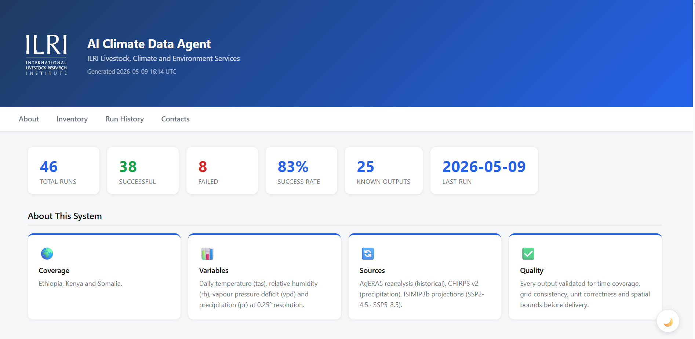
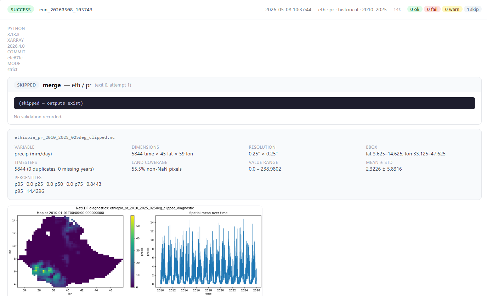
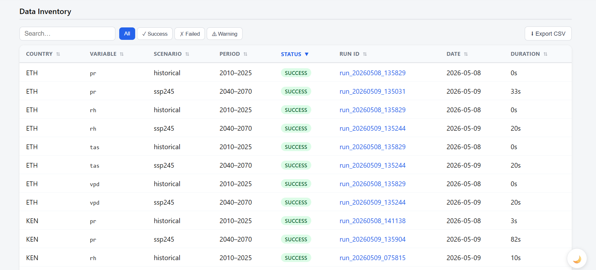
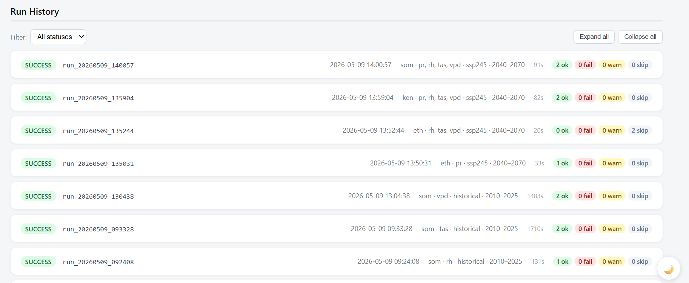
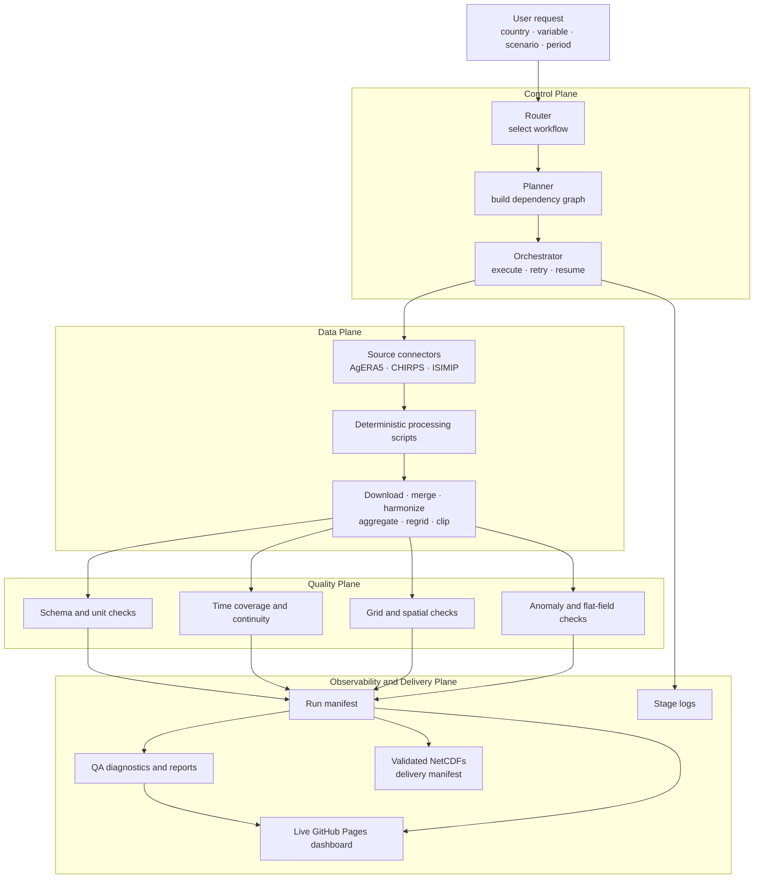
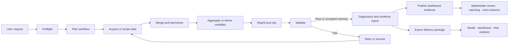
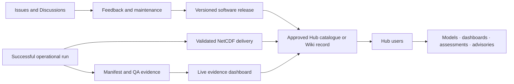

# Climate Data Harmonization Agent

## Climate Data Harmonization Agent for Automated Acquisition, Standardization, Validation and Delivery of Climate Data


[](https://yonsci.github.io/climate-agent/)
[](LICENSE.md)
[](https://github.com/YonSci/climate-agent/issues)

**Institutional context:** Developed for ILRI Climate Services to support climate-risk analysis, impact modelling, and harmonized climate-data preparation for livestock, agriculture, food security, drought, disease risk, and related decision-support applications.

**Project status:** Operational research software, version `0.1.0`. The repository demonstrates product development, documentation, reproducibility, validation, public sharing, and a live evidence dashboard. 

---

## Live dashboard

### [Open the Climate Data Harmonization Dashboard](https://yonsci.github.io/climate-agent/)

[](https://yonsci.github.io/climate-agent/)

*Dashboard overview showing operational run statistics, supported coverage, climate variables, data sources, and quality-assurance information. Select the image to open the live dashboard.*

### Automated validation, diagnostics, and run reports

[](https://yonsci.github.io/climate-agent/)


<details>
<summary><strong>View the data inventory</strong></summary>

[](https://yonsci.github.io/climate-agent/)

*Representative inventory view showing country, variable, scenario, period, processing status, run identifier, date, and duration.*

</details>

<details>
<summary><strong>View the run history</strong></summary>

[](https://yonsci.github.io/climate-agent/)

*Representative run-history view showing completed workflows, requested variables and scenarios, execution duration, and stage-level outcomes.*

</details>

The GitHub Pages dashboard is the public, human-readable evidence interface for the tool. It is generated from committed run manifests and associated diagnostic products and can be used to review:

- the current climate-data inventory;
- completed, warning, and failed processing runs;
- countries, variables, scenarios, periods, and run identifiers;
- stage-level status, commands, retries, and execution metadata;
- schema, unit, temporal, spatial, and anomaly checks;
- quality-control statistics and diagnostic plots; and
- evidence that outputs have been processed, validated, and documented.

The screenshots above are representative captures and may show historical generation dates or run statistics. The [live dashboard](https://yonsci.github.io/climate-agent/) is the source for the latest published evidence.

The dashboard complements the source code and machine-readable manifests. It supports demonstrations, technical review, stakeholder engagement, result reporting, and preparation for Climate Data Hub integration. It should not be presented as the formal Climate Data Hub catalogue or deployment record unless approved by the responsible institutional team.

The dashboard is generated by [`scripts/generate_report.py`](scripts/generate_report.py) and published through [`.github/workflows/pages.yml`](.github/workflows/pages.yml).

---

## Contents

- [Purpose](#purpose)
- [Contribution to the ILRI result](#contribution-to-the-ilri-result)
- [Readiness and evidence status](#readiness-and-evidence-status)
- [Intended users and use cases](#intended-users-and-use-cases)
- [Supported domain](#supported-domain)
- [Architecture](#architecture)
- [Workflow templates](#workflow-templates)
- [Quick start](#quick-start)
- [Outputs, validation, and provenance](#outputs-validation-and-provenance)
- [Climate Data Hub integration](#climate-data-hub-integration)
- [Monitoring, evaluation, learning, and reporting](#monitoring-evaluation-learning-and-reporting)
- [Community](#community)
- [Limitations and roadmap](#limitations-and-roadmap)
- [Project structure and testing](#project-structure-and-testing)
- [Data sources](#data-sources)
- [Licence](#licence)
- [Citation and contacts](#citation-and-contacts)

---

## Purpose

Impact modellers and climate-service teams need consistent datasets spanning observed and projected climate conditions. Preparing these datasets from raw archives involves repeated and error-prone tasks:

- locating and downloading data from multiple providers;
- merging fragmented daily or annual files;
- harmonizing names, units, calendars, dimensions, and metadata;
- regridding datasets to consistent spatial grids;
- clipping data to the requested period and geography;
- checking temporal completeness, spatial coverage, units, and anomalies; and
- documenting how each output was produced.

The Climate Data Harmonization Agent automates this sequence. A user specifies a country, variable, scenario, and period. The agent selects a workflow, builds an ordered dependency graph, executes the required stages, validates outputs, and records the complete run in a machine-readable manifest.

The tool addresses the data-preparation gap between raw climate archives and downstream models, dashboards, vulnerability assessments, early-warning systems, and climate-informed decision-support applications.

---

## Contribution to the ILRI result

This repository is designed to contribute to the following ILRI 2026 result.

| Result field | Contribution |
|---|---|
| **Result level** | Output |
| **Center** | ILRI |
| **Result short name** | Develop methods and pipelines for user-centred outputs and integrate ILRI climate-relevant analytical methods and pipelines within the Climate Data Hub. |
| **Indicator** | Number of frameworks, strategies, or tools developed and shared |
| **Standard result type** | Innovation development |
| **HLO contribution** | Harmonized data, simulations, insights, and decision-support tools for understanding climate risks, emission hotspots, and multidimensional trade-offs, co-developed and shared with stakeholders. |

### How the tool contributes

| Requirement | Repository contribution |
|---|---|
| **Develop a climate-relevant method, framework, or tool** | Provides an operational orchestration and quality-assurance tool for climate-data acquisition, harmonization, validation, diagnostics, and delivery. |
| **Produce user-centred outputs** | Converts a concise request into standardized datasets and evidence products without requiring users to manually execute every processing script. |
| **Harmonize climate data** | Applies consistent names, units, temporal checks, grids, geographic clipping, metadata, and output conventions across multiple sources. |
| **Develop and share the product** | Shares source code, configuration, examples, workflows, issue templates, contribution guidance, Wiki content, screenshots, and a public evidence dashboard. |
| **Support Climate Data Hub integration** | Produces standardized files, metadata, manifests, inventories, diagnostics, reports, and a public evidence interface that can be linked from an approved Hub record. |
| **Support decision tools and impact modelling** | Prepares inputs for livestock, agriculture, food security, drought, disease, climate-risk, and other modelling or dashboard workflows. |
| **Co-develop with users and partners** | Uses Issues and Discussions to record user needs, problems, proposed improvements, and stakeholder-informed changes. |

> **Reporting note:** The Climate Data Harmonization Agent should normally be counted as **one integrated tool** toward the target of two frameworks, strategies, or tools. Historical, projection, VPD, validation, diagnostics, dashboard, and reporting components are modules of the same product unless the reporting authority accepts independently packaged and independently shared products.

---

## Readiness and evidence status

| Readiness element | Status | Evidence |
|---|:---:|---|
| Source code and configuration | ✅ | Repository modules, scripts, configuration, and dependencies |
| Installation and usage guidance | ✅ | `README.md`, `USAGE.md`, and Wiki starter pages |
| Historical and projection workflows | ✅ | Router, planner, orchestrator, connectors, and processing scripts |
| Automated validation and diagnostics | ✅ | `validation/`, QA JSON, diagnostic plots, and run reports |
| Machine-readable provenance | ✅ | Run manifests and `run_manifest_schema.json` |
| Delivery packaging | ✅ | `--export-run` and `delivery_manifest.json` |
| Public evidence dashboard | ✅ | [GitHub Pages dashboard](https://yonsci.github.io/climate-agent/) |
| Dashboard screenshots | ✅ | `docs/images/` |
| Public sharing and reuse terms | ✅ | Public repository and Apache License 2.0 |
| Issues and contribution workflow | ✅ | Issue forms and `CONTRIBUTING.md` |
| Wiki starter content | ✅ | `docs/wiki/` pages |
| Formal Climate Data Hub record | ⬜ | Add the approved catalogue, Wiki, workflow, service, or application URL |
| Hub deployment or callable service | ⬜ | Agree the linked repository, container, scheduled pipeline, API, or service pattern |
| Stakeholder demonstration record | ⬜ | Retain agenda, participants, feedback, and acceptance evidence |
| Additional target-country validation | ⬜ | Add configurations, test runs, and evidence for each claimed country |
| Versioned institutional release | ⬜ | Create a tagged release and archive the evidence package |

---

## Intended users and use cases

### Primary users

- ILRI climate, livestock, environment, and impact-modelling teams;
- Climate Data Hub data managers and analytical-product developers;
- national meteorological and hydrological services;
- agriculture, livestock, food-security, and disaster-risk institutions;
- researchers and technical partners preparing climate-impact datasets; and
- analysts developing dashboards, advisories, forecasting systems, or early-warning applications.

### User-centred examples

| User need | Agent response |
|---|---|
| Prepare daily temperature and rainfall for Ethiopia for 2010–2025. | Selects historical sources, downloads missing files, merges, harmonizes, clips, validates, and delivers the requested data. |
| Prepare projected climate inputs for Kenya under SSP2-4.5 for 2040–2070. | Resolves ISIMIP inputs, harmonizes variables, aggregates where needed, clips, validates, and records provenance. |
| Generate future VPD for livestock heat-stress analysis. | Resolves temperature and humidity inputs, derives VPD, writes metadata, and validates the result. |
| Verify whether delivered data are complete and spatially valid. | Produces validation results, QC statistics, diagnostics, manifests, logs, and dashboard-ready evidence. |
| Review processed datasets without reading JSON files. | Opens the [live dashboard](https://yonsci.github.io/climate-agent/) to inspect inventory, run history, validation, QC, and diagnostics. |
| Reproduce or audit an earlier delivery. | Uses the saved request, commands, environment metadata, validation results, and delivery manifest. |

A user specifies **where**, **what**, **scenario**, **period**, **quality level**, and optional diagnostics or export products.

---

## Supported domain

| Dimension | Current configuration |
|---|---|
| **Countries** | Ethiopia (`eth`), Kenya (`ken`), Somalia (`som`) |
| **Variables** | `tas` temperature, `rh` relative humidity, `vpd` vapour pressure deficit, `pr` precipitation |
| **Scenarios** | `historical`, `ssp245`, `ssp585` |
| **Reference and target grids** | CHIRPS 0.05° may be used as a historical reference; configured final target resolution is 0.25° where applicable |
| **Period** | Any contiguous period supported by the selected source |
| **Products** | NetCDF, JSON manifests, QA JSON, PNG diagnostics, logs, delivery inventories, HTML reports, screenshots, and a public evidence dashboard |

The associated ILRI result lists Ethiopia, Ghana, Kenya, Tanzania, and Uganda. This repository currently contains operational configurations for Ethiopia, Kenya, and Somalia. Reporting must distinguish implemented and validated geographies from planned or technically extensible geographies.

---

## Architecture



### Main modules

| Module | Responsibility |
|---|---|
| `agent/router.py` | Selects historical, projection, VPD, diagnostics, or related workflow templates. |
| `agent/planner.py` | Constructs the ordered dependency graph. |
| `agent/orchestrator.py` | Executes stages and manages retry, resume, validation, continuation, and recording. |
| `agent/state_store.py` | Stores run manifests and supports reproducible recovery. |
| `agent/artifact_manager.py` | Centralizes expected paths and delivery artifacts. |
| `connectors/` | Builds source-specific acquisition commands. |
| `validation/` | Performs schema, temporal, spatial, and anomaly checks. |
| `scripts/generate_report.py` | Produces the HTML dashboard and human-readable validation evidence. |

---

## Workflow templates



### Historical workflow

AgERA5 and CHIRPS inputs are located or downloaded, merged, harmonized, regridded, clipped to time and geography, validated, and documented.

### Projection workflow

ISIMIP model, scenario, and variable inputs are resolved, renamed, aggregated where required, regridded, clipped, validated, and documented.

### Future VPD workflow

Projected temperature and humidity are resolved and converted as required before calculating:

```text
VPD = 6.1078 × exp(17.27 × T / (T + 237.3)) × (1 − RH/100)
```

where `T` is temperature in °C, `RH` is relative humidity in percent, and VPD is returned in hPa.

---

## Quick start

### 1. Clone and install

```bash
git clone https://github.com/YonSci/climate-agent.git
cd climate-agent
python -m venv .venv
```

```bash
# Linux/macOS
source .venv/bin/activate

# Windows PowerShell
.venv\Scripts\Activate.ps1
```

```bash
pip install -e .
# Development and testing
pip install -e ".[dev]"
```

### 2. Configure data access

AgERA5 acquisition requires Copernicus Climate Data Store credentials in `~/.cdsapirc`. Never commit credentials or access tokens.

### 3. Preview the workflow

```bash
python run_agent.py \
  --countries eth \
  --variables tas pr \
  --scenario historical \
  --period 2010 2025 \
  --diagnostics \
  --dry-run
```

### 4. Execute, inspect, and export

```bash
python run_agent.py \
  --countries eth \
  --variables tas pr \
  --scenario historical \
  --period 2010 2025 \
  --diagnostics

python run_agent.py --list-runs
python run_agent.py --validate-run RUN_ID
python run_agent.py --export-run RUN_ID --export-to /path/to/delivery
```

### 5. Review published evidence

Open the [live dashboard](https://yonsci.github.io/climate-agent/) after the GitHub Pages workflow has published the latest committed manifests and diagnostics.

See [`USAGE.md`](USAGE.md) and [`docs/wiki/Getting-Started.md`](docs/wiki/Getting-Started.md) for additional run patterns, recovery, logging, and validation guidance.

---

## Outputs, validation, and provenance

### Delivery and evidence products

| Product | Purpose |
|---|---|
| Final NetCDF files | Analysis-ready climate inputs |
| Run manifest JSON | Request, stages, commands, status, environment, and validation evidence |
| QA JSON | File-level statistics and quality checks |
| Diagnostic PNG | Visual review of spatial patterns and temporal behaviour |
| Structured log | Execution history and error context |
| `run_report.json` | Machine-readable run summary |
| `delivery_manifest.json` | Inventory of exported products, sizes, source run, and copy status |
| Static HTML dashboard | Human-readable inventory, run history, validation, QC statistics, and diagnostics |
| Dashboard screenshots | Stable visual evidence for documentation, presentations, and reports |
| GitHub Pages URL | Public access point for demonstrations, technical review, and reporting evidence |

### Core checks

- file existence and non-zero size;
- expected variable, dimensions, and canonical units;
- requested temporal coverage and daily continuity;
- non-missing land coverage;
- grid, coordinates, spatial bounds, and cross-file consistency; and
- warning-level checks for outliers, anomalies, flat fields, or saturated fields.

### Operational acceptance

Before delivery or Hub registration:

- required stages should succeed or have documented and accepted warnings;
- final files should pass schema, unit, temporal, and spatial checks;
- a domain expert should review diagnostics for physical plausibility;
- run and delivery manifests should accompany the data;
- the dashboard should display the expected run and evidence where public publication is appropriate;
- source, period, scenario, grid, units, processing version, and limitations should be recorded; and
- source-provider licence and redistribution conditions should be respected.

Each formal delivery should record the Git commit SHA, version tag, configuration, source versions and access dates, run manifest, delivery manifest, dashboard URL, representative screenshot, and associated Hub record.

---

## Climate Data Hub integration

The repository and live dashboard are **integration-ready evidence components**, but neither a repository link nor a GitHub Pages dashboard alone is proof of completed Climate Data Hub integration.



### Recommended integration components

- approved product record containing purpose, owner, version, countries, variables, sources, contacts, and dashboard URL;
- linked versioned code release and methodology documentation;
- registered data products or storage locations with consistent metadata;
- published or archived provenance, QA, dashboard, screenshot, and delivery evidence;
- agreed access pattern: repository, container, scheduled workflow, API, or managed service;
- completed demonstration for a priority country and use case;
- documented governance, maintenance, licences, access controls, and review cycle; and
- user-support route through Issues, Discussions, training, and known limitations.

### Minimum evidence for claiming integration

- active Hub catalogue, Wiki, workflow, service, or application URL;
- dashboard or screenshot showing representative operational evidence;
- approved metadata and product owner;
- working example accessed through the agreed Hub route;
- successful run and associated evidence products; and
- confirmation from the responsible ILRI or Hub technical lead.

---

## Monitoring, evaluation, learning, and reporting

A reporting evidence package should contain:

- product title, description, indicator contribution, intended users, and live dashboard URL;
- tagged release or archived source code;
- README, usage guide, methodology, workflows, and configuration;
- successful run manifest and software version;
- QA JSON, validation results, diagnostics, and dashboard report;
- representative dashboard screenshots;
- final delivery inventory and representative outputs;
- Climate Data Hub registration or deployment evidence;
- demonstration, training, or sharing evidence;
- user requirements, GitHub Issues or Discussions, feedback, and resulting improvements; and
- completed validation evidence for every claimed geography.

### Suggested reporting statement

> The Climate Data Harmonization Agent is a user-centred analytical tool developed for ILRI Climate Services to automate the acquisition, harmonization, validation, documentation, and delivery of historical and projected climate datasets. It converts user-defined requests into analysis-ready NetCDF products and generates structured provenance, quality-control diagnostics, reports, delivery manifests, dashboard screenshots, and a public GitHub Pages evidence dashboard. Its source code, documentation, and dashboard are openly shared, while formal Climate Data Hub integration is evidenced through the corresponding approved Hub catalogue, Wiki, workflow, service, or application record.

### Completion checklist

- [ ] Versioned release created and archived
- [ ] At least one successful operational example retained and visible in the dashboard
- [ ] Run manifest, QA, diagnostics, report, and delivery manifest archived
- [x] Dashboard URL and representative screenshots included in repository documentation
- [ ] Climate Data Hub registration or deployment evidence attached
- [ ] Stakeholder demonstration completed
- [ ] Feedback and resulting improvements documented through Issues or Discussions
- [ ] Country claims supported by completed validation evidence
- [ ] Product ownership, copyright, and maintenance arrangements confirmed

---

## Community

### GitHub Issues

Use [Issues](https://github.com/YonSci/climate-agent/issues) for reproducible bugs, scoped feature requests, documentation defects, country or data-source requests, and implementation tasks.

### GitHub Discussions

Use [Discussions](https://github.com/YonSci/climate-agent/discussions) for questions, scientific-method conversations, design proposals, demonstrations, stakeholder feedback, and early ideas.

### GitHub Wiki

The `docs/wiki/` directory contains starter pages for getting started, architecture and workflows, Climate Data Hub integration, validation and evidence, and frequently asked questions.

Keep stable tutorials and methods in the Wiki, track actionable work in Issues, and use Discussions for collaborative questions and ideas. See [`CONTRIBUTING.md`](CONTRIBUTING.md).

---

## Limitations and roadmap

### Current limitations

- Operational country configurations are limited to Ethiopia, Kenya, and Somalia.
- Formal Climate Data Hub registration or deployment is not demonstrated by the repository or dashboard alone.
- The dashboard reflects evidence available to the GitHub Pages publishing workflow; uncommitted or privately stored runs will not appear.
- Dashboard screenshots are static and may not reflect the latest live statistics.
- Data availability, credentials, calendars, naming, licences, and redistribution conditions vary by provider.
- Large multi-country and multi-decadal requests can require substantial storage and processing resources.
- Automated checks do not replace expert assessment of physical plausibility and model suitability.
- Institutional ownership and attribution should be confirmed before the first formal institutional release.

### Priority roadmap

1. Confirm institutional ownership and approve the software licence and attribution.
2. Create a tagged release with an archived evidence package.
3. Retain representative validated runs and diagnostics in the dashboard evidence set.
4. Register the product and dashboard in the Climate Data Hub catalogue or Wiki.
5. Agree the Hub access pattern: linked product, container, API, scheduled workflow, or managed service.
6. Publish validated examples for Ethiopia and Kenya.
7. Add and validate Ghana, Tanzania, and Uganda where required.
8. Conduct stakeholder demonstrations using the live dashboard and document feedback-driven improvements.
9. Add automated test execution and release checks in GitHub Actions.

---

## Project structure and testing

```text
climate-agent/
├── run_agent.py
├── agent_config.yaml
├── run_manifest_schema.json
├── pyproject.toml
├── README.md
├── USAGE.md
├── CONTRIBUTING.md
├── LICENSE.md
├── agent/
├── connectors/
├── validation/
├── scripts/
├── boundaries/
├── tests/
├── docs/
│   ├── images/
│   │   ├── dashboard-overview.png
│   │   ├── dashboard-inventory.png
│   │   └── dashboard-run-history.png
│   └── wiki/
└── .github/
    ├── ISSUE_TEMPLATE/
    └── workflows/
```

Install development dependencies and run tests:

```bash
pip install -e ".[dev]"
pytest tests/ -q
pytest tests/ -q --cov=agent
```

For code, configuration, country, variable, or workflow changes, run relevant unit and integration tests and document the scientific and operational acceptance criteria.

---

## Data sources

| Source | Variables or use | Provider |
|---|---|---|
| [AgERA5](https://cds.climate.copernicus.eu/datasets/sis-agrometeorological-indicators) | Historical temperature, humidity, and related agrometeorological indicators | Copernicus Climate Change Service / ECMWF |
| [CHIRPS v2.0](https://www.chc.ucsb.edu/data/chirps) | Historical precipitation | Climate Hazards Center, University of California, Santa Barbara |
| [ISIMIP3b](https://www.isimip.org/) | Climate-model projections and impact-modelling inputs | Inter-Sectoral Impact Model Intercomparison Project |

The Apache software licence does not replace source-data terms. Users must comply with each provider’s access, citation, attribution, and redistribution requirements. Generated outputs should retain source attribution and processing metadata.

---

## Licence

The source code and repository documentation are licensed under the **Apache License 2.0**, unless a file explicitly states otherwise. See [`LICENSE.md`](LICENSE.md).

Apache 2.0 permits commercial and private use, modification, and distribution, subject to preservation of required notices and documentation of changes. It also includes an express patent grant and limitations on trademark use, liability, and warranty.

Third-party datasets, boundaries, software dependencies, logos, trademarks, and externally sourced materials remain subject to their own terms. Confirm institutional ownership and copyright attribution with ILRI or the relevant rights holder before the first formal institutional release.

Contributions are governed by [`CONTRIBUTING.md`](CONTRIBUTING.md).

---

## Citation and contacts

### Suggested software citation

Until a formal release and DOI are created:

> Demissie, T, Mersha, Y. *Climate Data Harmonization Agent: automated acquisition, harmonization, validation, dashboard reporting, and delivery of climate datasets*. ILRI Climate Services. Version 0.1.0. GitHub repository: `YonSci/climate-agent`. Dashboard: `https://yonsci.github.io/climate-agent/`.

A formal release should add the date, version tag, commit SHA, DOI or institutional identifier, and corresponding Climate Data Hub record.

### Questions, collaboration, and data requests

**ILRI Climate Services — Livestock, Climate and Environment**

- Yonas Mersha — [Y.Mersha@cgiar.org](mailto:Y.Mersha@cgiar.org)
- Dr Teferi Demissie — [t.demissie@cgiar.org](mailto:t.demissie@cgiar.org)

Use GitHub Issues for actionable bugs and feature requests. Use GitHub Discussions for questions, ideas, methods, demonstrations, and stakeholder feedback.
