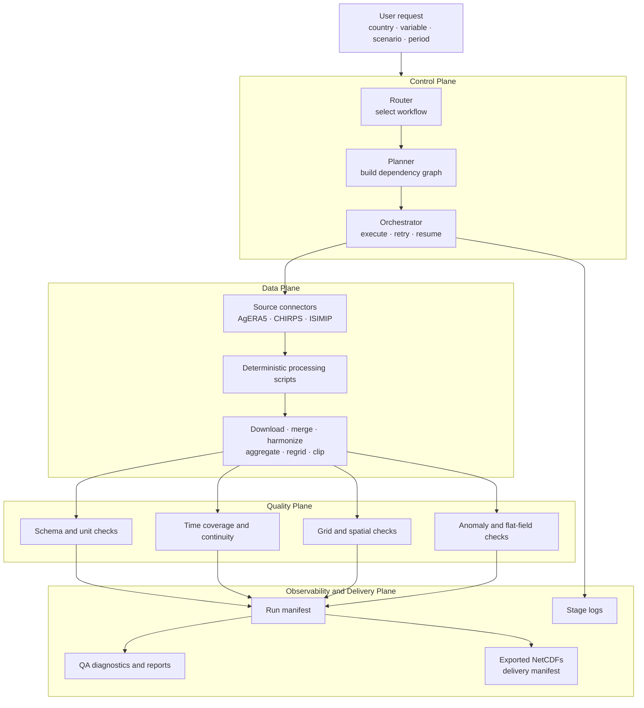
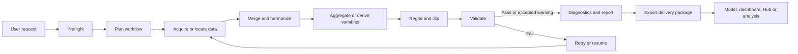

# Architecture and Workflows

## Four-plane architecture

## Operational workflow

## Main modules

| Module | Responsibility |
|---|---|
| `agent/router.py` | Selects the workflow template from the user request. |
| `agent/planner.py` | Constructs the ordered dependency graph. |
| `agent/orchestrator.py` | Executes stages and manages retry, resume, validation, and recording. |
| `agent/state_store.py` | Stores run manifests and supports reproducible recovery. |
| `agent/artifact_manager.py` | Centralizes expected paths and delivery artifacts. |
| `connectors/` | Builds source-specific acquisition commands. |
| `validation/` | Performs schema, temporal, spatial, and anomaly checks. |
| `scripts/generate_report.py` | Produces human-readable run and validation evidence. |

## Design principles

- deterministic processing steps are separated from orchestration;
- each stage has explicit inputs, outputs, and dependencies;
- quality checks are recorded rather than hidden;
- failed slices can be retried without discarding successful work;
- every delivery can be linked to a run manifest and software version; and
- integration products are prepared for registration in the Climate Data Hub.
