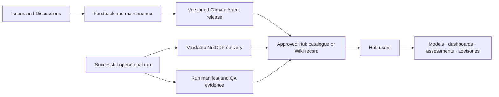

# Climate Data Hub Integration

The Climate Data Harmonization Agent is designed to produce standardized datasets, metadata, provenance, quality-control evidence, and delivery inventories that can be registered or exposed through the Climate Data Hub. A public repository alone is not sufficient evidence of completed institutional integration.

## Recommended integration pattern

## Product metadata

The Hub record should include:

- product name and short description;
- institutional owner and technical maintainer;
- software version, release date, and commit SHA;
- supported countries, variables, scenarios, periods, and grids;
- input data sources and provider licences;
- processing and validation methods;
- access route for code and generated datasets;
- example run and evidence package;
- known limitations and responsible-use statement; and
- support, issue-reporting, and review-cycle information.

## Minimum evidence before claiming integration

- active Climate Data Hub catalogue, Wiki, workflow, service, or application URL;
- screenshot or export showing the product in the Hub;
- approved metadata and named product owner;
- a working example accessed through the agreed Hub route;
- successful run manifest, QA results, diagnostics, and delivery manifest; and
- confirmation from the responsible ILRI or Hub technical lead.

## Possible technical access patterns

1. **Linked repository:** the Hub record links to a tagged release and documentation.
2. **Registered data product:** exported NetCDF datasets and metadata are catalogued in the Hub.
3. **Containerized workflow:** the agent is packaged and invoked in an approved compute environment.
4. **Scheduled pipeline:** priority datasets are refreshed on a defined operational schedule.
5. **API or service:** users submit validated requests without working directly at the command line.

The chosen pattern should be documented as implemented, planned, or out of scope. Do not describe a planned integration as operational.
